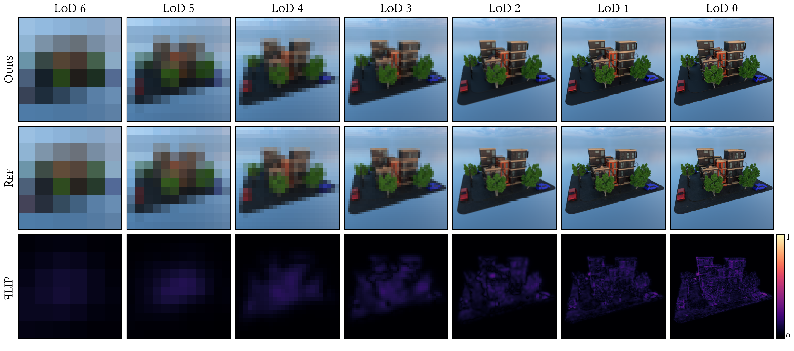

# Neural Prefiltering for Correlation-Aware Levels of Detail 



Source code of the paper "Neural Prefiltering for Correlation-Aware Levels of Detail
" by [Philippe Weier](https://weiphil.github.io/portfolio/), Tobias Zirr, Anton Kaplanyan, Ling-Qi Yan and Philipp Slusallek at SIGGRAPH 2023.

The implementation is based on the [Real-Time Path Tracing Framework from Intel](https://github.com/intel/RealTimePathTracingResearchFramework).

You can find the original paper and supplemental viewer on the [project webpage](https://weiphil.github.io/portfolio/neural_lod).

## Building the project

We tested our implementation with the following configuration:

- Ubuntu 22.04
- gcc 11.3 and g++ 11.3 (Linux) / Visual Studio 17 2022 (Windows)
- Cuda Compiler NVIDIA 11.3.109
- Nvidia Driver 525.85.05 / 535.129.03
- Cuda Architectures 75/86

#### Required Cuda Compute Capability

Our implementation depends on the FullyFusedMLP implementation of TinyCudaNN which requires at least Compute Capability 7.5.
Make sure you set the variable CMAKE_CUDA_ARCHITECTURES="your_gpu_compute_capabability" appropriately for your GPU. A list with the compute capability associated with every GPU can be found [here](https://developer.nvidia.com/cuda-gpus)

### Linux

From the rptr project directory configure and build the project as follows:

```bash
mkdir build && cd build
```
```bash
cmake -GNinja -DCMAKE_CXX_COMPILER=g++ -DCMAKE_C_COMPILER=gcc -DENABLE_NEURAL_LOD=ON -DCMAKE_BUILD_TYPE=Release -DCMAKE_CUDA_ARCHITECTURES="compute_capabability"..
```
```bash
ninja
```
If you are running into a posix-related error while re-building the simplest solution is to clean the CMakeFiles as follows:
```bash
rm -rf CMakefiles/ && rm CMakeCache.txt
```

Once compiled you can run a scene with a given configuration file **from the build folder** as follows:
```bash
./rptr ../../neural_lod/scenes/arcade/arcade.vks --config ../../neural_lod/scenes/arcade/arcade_world_final.ini --img 1024 1024
```
 
## Getting the scenes used in the paper

The repository only ships with the Arcade scene. The other scenes used in the paper can be downloaded separately [from the University of Saarland Cloud Server](https://oc.cs.uni-saarland.de/owncloud/index.php/s/jiBspDkSkGW9yPT) along with the pre-trained network weights. Simply download and copy the scene folders next to the arcade scene folder in `neural_lod/scenes/`. The other pre-trained scenes can then be rendered similarly, for example, to run the pre-trained Bay Cedar scene from the Moana Scene data-set use:  

```bash
./rptr ../../neural_lod/scenes/isBayCedarA1/isBayCedarA1.vks --config ../../neural_lod/scenes/isBayCedarA1/isBayCedarA1_world_final.ini --img 1024 1024
``` 

## Script for rendering all levels of detail

The script located at `neural_lod/results/scripts/render_learned.py` will launch the application, render the references as well as the neural prefiltered level of details and finally output a comparison figure between the reference and our approach at the end of the process. Note: the application still responds to user inputs while rendering so make sure to not change the camera while rendering. The Python script requires the following packages to be installed on your system (via pip install for example):

- simpleimageio (https://pypi.org/project/simpleimageio/)
- figuregen (https://github.com/Mira-13/figure-gen)
- opencv-python
- numpy
- matplotlib

For an example usage, the following command renders all neural and reference LoDs for the arcade scene and stores the resulting images at `neural_lod/results/arcade/`:
```bash
python3 render_learned.py ../../neural_lod/scenes/arcade/arcade.vks --config_path ../../neural_lod/scenes/arcade/arcade_world_final.ini --result_dir ../../neural_lod/results/arcade/ --ref_spp 512 --spp 4096 --skip_present
```

To render other scenes only the scene name needs to be adapted. The previous script renders the scene with a constant background of 1, optionally, `render_learned_envmap.py` can be used to render the scene with a given HDR environment map, for example:

```bash
python3 render_learned_envmap.py ../../neural_lod/scenes/isBayCedarA1/isBayCedarA1.vks --config_path ../../neural_lod/scenes/isBayCedarA1/isBayCedarA1_world_final.ini --result_dir ../../neural_lod/results/isBayCedarA1_envmap/ --ref_spp 1024 --spp 16384 --envmap_file syferfontein_6d_clear_puresky_2k.exr --envmap_rotation 60 --skip_present
```

## Learning visibility and appearance

If a scene is opened without any pre-trained weights you will need to optimise visibility and prefiltered appearance in the `Throughput Optim` and `Visibility Optim` tabs of the `Neural Lod Learning` window. After configuring the network input encoding and MLP as desired, start the optimisation by pressing `Restart Throughput/Visibility Optimization`. To visualise the result make sure to select the appropriate renderer variant in the `Renderer` window.

## Create and render a custom scene

To render and learn the prefiltered version of a scene of your choice a few steps are necessary. 

### VKS/VKT Scene format export

To convert a scene with associated textures we provide a few helper scripts:

- A blender plugin to export blender scenes to the `.vks` format at `neural_lod/libvkr/build/release/blender_vkr.zip`
- A very basic blender script for exporting the scene materials is provided in `neural_lod/results/scripts/blender_material_export.py`. You can open it in the scripting tab of Blender, set the output folder and execute it. Note that the script only outputs the default colour of every material, support for arbitrary node graphs is not supported.
- To convert the textures to the .vkt format you will need to have the `pyvkr` package in your PATH. Check out the readmes at `neural_lod/libvkr/README.md` and `neural_lod/libvrk/scripts/README.md`. Once the pyvkr package is in your path you can use our texture conversion script at `neural_lod/results/scripts/convert_textures.py` to convert the textures. For example, for a test scene `test`, use `python3 convert_textures.py ../../scenes/test/test.vks ../../scenes/test/test_textures/` where `test_textures` contains all the textures previously exported from Blender.

The `libvkr` project provides, among other helpful scripts, a way to check the metadata of a `.vks` scene file which also shows the expected path of the textures.

### Scene Voxelisation

Our prefiltering technique requires a voxelised scene as input. This is provided in the form of a point cloud obj file where every vertex corresponds to the centre of a voxel. We generate this obj point cloud file using a slightly modified version of the [cuda-voxeliser](https://github.com/Forceflow/cuda_voxelizer) library located at `neural_lod/cuda_voxelizer`. The library also depends on the [trimesh library](https://github.com/Forceflow/trimesh2). To build those two libraries, make sure to check out the original README of the respective projects. 

Once the cuda_voxelizer is successfully compiled you can use the `neural_lod/results/scripts/voxelize.py` script to convert a .vks scene to a point cloud file. Assuming a test_scene `test` simply use:

```bash
python3 voxelize.py ../../scenes/test/test.vks ../../scenes/test/test
```

You should now be able to open your custom test scene using `./rptr ../../neural_lod/scenes/test/test.vks` and learn the prefiltered visibility and appearance as described above.

### Citation

```bibtex
@article{10.1145/3592443,
author = {Weier, Philippe and Zirr, Tobias and Kaplanyan, Anton and Yan, Ling-Qi and Slusallek, Philipp},
title = {Neural Prefiltering for Correlation-Aware Levels of Detail},
journal = {ACM Trans. Graph.},
issue_date = {August 2023},
volume = {42},
number = {4},
month = {jul},
articleno = {78},
numpages = {16},
year = {2023},
url = {https://doi.org/10.1145/3592443},
doi = {10.1145/3592443},
publisher = {Association for Computing Machinery},
address = {New York, NY, USA},
}
```
